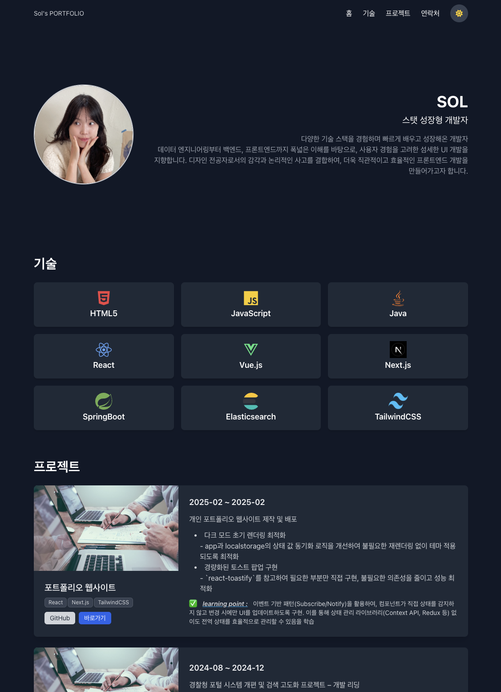

# 🚀 My Portfolio



This is my personal **portfolio website** built with modern web technologies.  
It showcases my projects, skills, and experiences as a frontend developer.

## 🛠 Tech Stack

- **TypeScript**
- **React**
- **Next.js**
- **TailwindCSS**

## 📂 Features

- 🚀 **Fast and responsive** design with TailwindCSS
- 🌍 **SEO optimized** with Next.js
- 🎨 **Minimal and modern UI**
- 🔥 **Deployed on Vercel**

## 🔧 Installation & Setup

To run the project locally, follow these steps:

```sh
# 1. Clone the repository
git clone https://github.com/soloolol/sol-portfolio.git

# 2. Change into the project directory
cd your-portfolio

# 3. Install dependencies
npm install  # or yarn install

# 4. Run the development server
npm run dev  # or yarn dev
```

📸 Preview

✨ Live Demo
🔗 https://sol-portfolio.vercel.app
